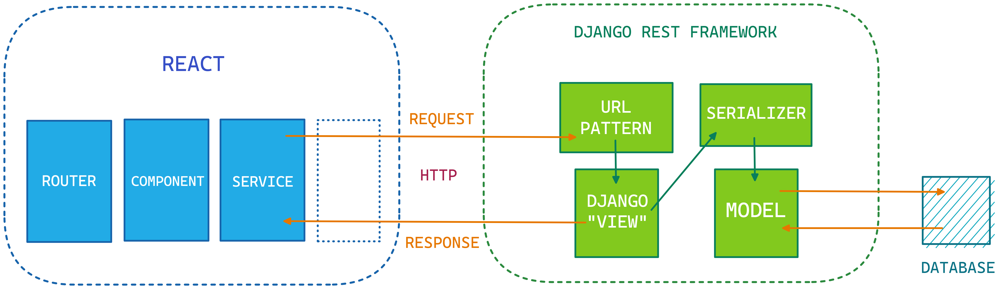

# **`IntDesk`**

Your go-to interview preparation platform

# **Project Overview**

`IntDesk` is an all-in-one interview preperation platform. Here the users can not only solve problems that are asked in interviews of different software companies, but also can take assesments and earn different badges to showcase their skills. They can also dicuss about interview problems and many more topics!

# **Project Architecture**

We followed the MVC Architecture for this project

# **Tech Stack & Tools**

- Frontend : `React`, `HTML`, `CSS`
- Backend : `Django Rest Framework`
- Database : `PostgreSQL`
- Miscellaneous : `Docker`, `Postman` 