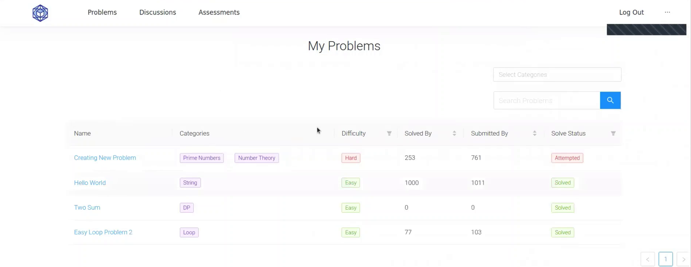
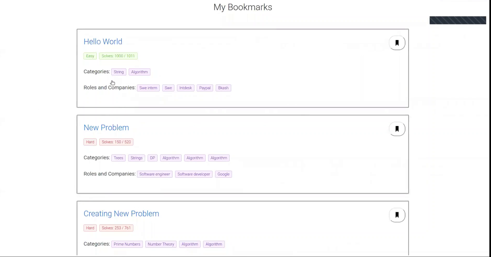
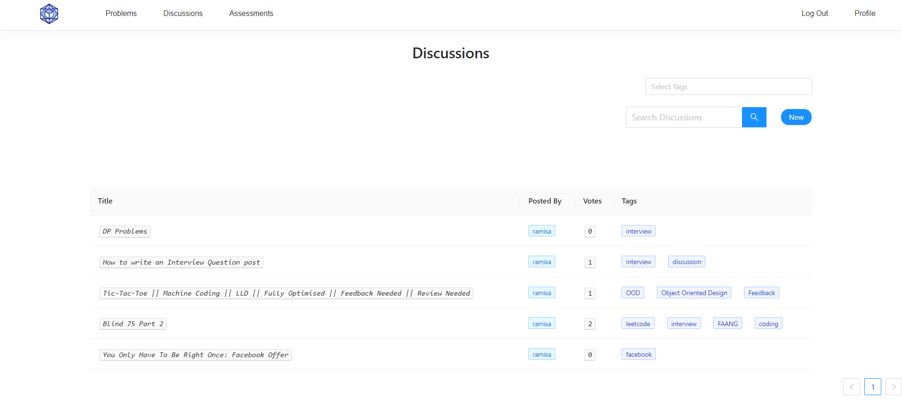

# **`IntDesk`**

 
Your go-to interview preparation platform

# **Project Overview**

`IntDesk` is an all-in-one tech interview preperation platform. Here the users can not only solve problems that are asked in interviews of different software companies, but also can take assesments and earn different badges to showcase their skills. They can also discuss about interview problems and many more topics!

The project is deployed on Netlify and can be accessed here : [https://intdesk.netlify.app/](https://intdesk.netlify.app/)

The backened of the project can be found in the following repository 

# **Project Architecture**

We followed the MVC Architecture for this project

# **Tech Stack & Tools**

- Frontend : `React`, `HTML`, `CSS`
- Backend : `Django Rest Framework`
- Database : `PostgreSQL`
- Miscellaneous : `Docker`, `Postman` 
  
# **Features**

Home page of the website features all the functionalities of the website. The main features are Problem Solving, Assessments, Discussion Forum, Profile, Badges and Recommendations.

## Problems

TBD

## Assesments

TBD

## Discussions

Users can discuss about **interview problems** and many more topics! They can also ask **questions** and get **answers** from other users. They can also **upvote** or **downvote** the discussions. There is also **comment section** for each discussion which supports rich text and reply thread.

Users can also **search** for discussions using **tags** and **keywords**.

## Profile

Users can view their profile and edit their profile details. They can also view their **badges**, **solved problems**, **discussions** and **assesments**. Plus they can find out how many easy, medium and hard problems they have solved and their activity on the website in a timeline format.

## Recommendation

TBD
